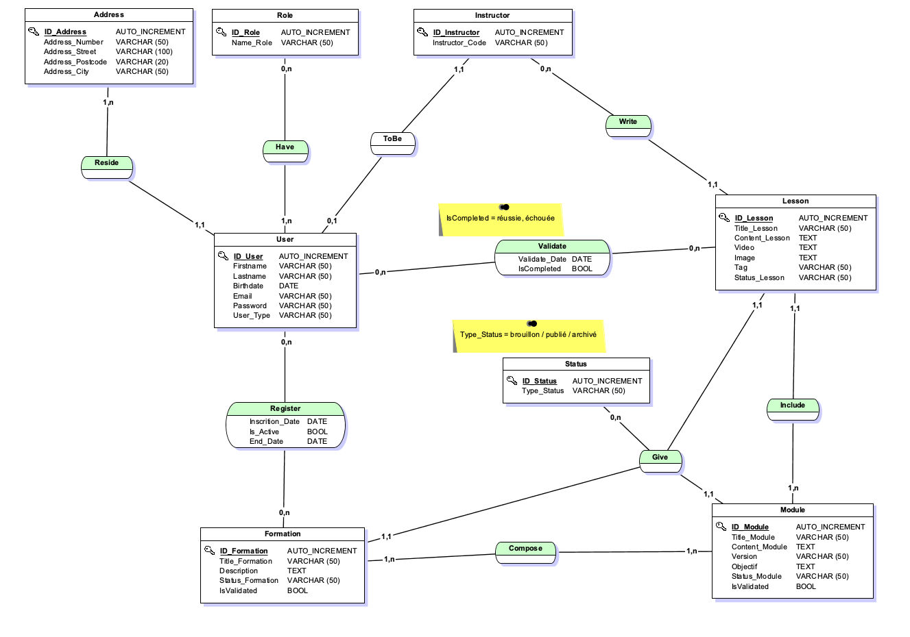

# MCD (Modèle Conceptuel des Données)

Le Modèle Conceptuel de Données (MCD) est une étape fondamentale dans la conception d'une base de données, permettant de définir de manière abstraite et indépendante de toute technologie les données à manipuler ainsi que leurs relations.  
Ce modèle aide à minimiser les erreurs dans la conception des bases de données et à aligner étroitement le système d'information avec les besoins métier.

Ces étapes résument le processus de création d'un MCD :

### **1. Analyse des Besoins**

Collecter et analyser les exigences des utilisateurs pour déterminer les données nécessaires et les fonctionnalités du système.

### **2. Identification des Entités**

- Définir les entités principales du domaine d’application et leurs attributs respectifs.
- Déterminer les associations, ou relations entre les entités.
- Spécifier leurs cardinalités (ex. un-à-un, un-à-plusieurs, plusieurs-à-plusieurs), permettant de préciser combien d'instances d'une entité peuvent être associées à combien d'instances d'une autre entité.

### **3. Règles de Gestion**

Formuler les contraintes et les règles de gestion qui régissent les relations et les attributs des entités.

### **5. Modélisation avec un Outil de Conception**

Nous utiliserons l'outil JMerise.

### **6. Validation et Révision**

Valider le modèle avec les parties prenantes pour s'assurer qu'il répond aux besoins métier et ajuster le modèle en fonction des retours reçus.

[🔝 Retour à la Table des matières](../../README.md#table-des-matieres)
