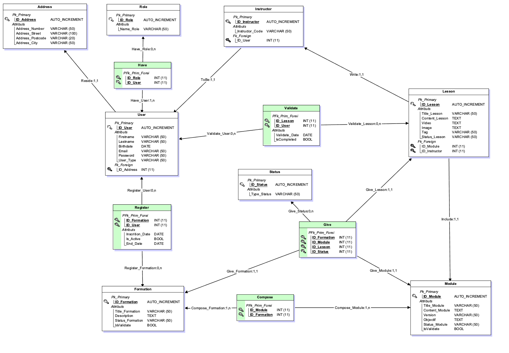

# MLD (Modèle Logique des Données)

En passant du MCD au MLD, l'objectif est de traduire une représentation conceptuelle des données en une structure logique prête pour l'implémentation, tout en assurant l'intégrité, la performance, et la maintenabilité de la base de données.  
Ce processus nécessite une compréhension approfondie à la fois des besoins métier et des capacités du système de gestion de base de données qui sera utilisé (PostgreSQL dans notre cas).

### **1. Identification des Entités**

Chaque entité du MCD est convertie en table dans le MLD, avec les attributs de l'entité devenant les colonnes de la table.

### **2. Clés Primaires - PK**

Une clé primaire est assignée à chaque table, issue des attributs existants de l'entité ou ajoutée spécifiquement pour servir d'identifiant unique.  
Un UUID (Universally Unique Identifier) sera attribué aux tables User et Instructor.

- 2.1 **Unicité Garantie**  
   Les UUID sont conçus pour être uniques à l'échelle mondiale. L'utilisation de UUID réduit pratiquement à zéro la possibilité de collisions (deux entités ayant le même identifiant), ce qui est particulièrement important dans les systèmes distribués où des données peuvent être générées sur différents serveurs ou emplacements.

- 2.2 **Sécurité Améliorée**  
   Les UUID offrent une meilleure sécurité par obscurité par rapport aux identifiants numériques incrémentiels. Avec un identifiant incrémentiel, un utilisateur malveillant pourrait facilement deviner les identifiants d'autres utilisateurs et potentiellement accéder à leurs informations. Les UUID, étant non séquentiels et complexes, rendent cette prédiction beaucoup plus difficile.

- 2.3 **Facilité de Fusion et Synchronisation**  
   Dans les systèmes qui nécessitent la fusion de bases de données ou la synchronisation régulière de données entre différents systèmes ou services, les UUID facilitent ce processus sans risque de duplication des identifiants.

- 2.4 **Indépendance des Données**  
   L'attribution d'un UUID à un enregistrement dès sa création permet à cet enregistrement d'être référencé de manière unique sans dépendre de détails spécifiques à la base de données ou à la table.

- 2.5 **Évolutivité**  
   Les UUID permettent une évolutivité plus aisée des systèmes. Puisqu'ils ne requièrent pas de vérification centralisée pour garantir l'unicité.

### **3. Transformation des Associations**

Les relations entre les entités sont converties en relations appropriées entre les tables, incluant l'ajout de clés étrangères pour les relations un-à-plusieurs (One-To-Many), et la création de tables d'association pour les relations plusieurs-à-plusieurs (Many-To-Many).

### **4. Normalisation - 3NF minimum**

Les tables sont normalisées pour éliminer la redondance des données et prévenir les anomalies de mise à jour, alignant chaque table sur les formes normales appropriées.

### **5. Intégration des Contraintes d'Intégrité**

Les contraintes d'intégrité, comme les contraintes d'unicité, les contraintes de clé étrangère, et les contraintes de vérification, sont établies pour garantir l'intégrité des données.

### **6. Index**

Des index peuvent être ajoutés pour optimiser les performances des requêtes, ciblant les colonnes fréquemment utilisées dans les recherches ou les jointures.

[🔝 Retour à la Table des matières](../../README.md#table-des-matieres)
