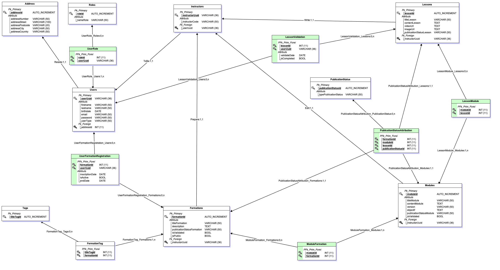

# MLD (Modèle Logique des Données)

En passant du MCD au MLD, l'objectif est de traduire une représentation conceptuelle des données en une structure logique prête pour l'implémentation, tout en assurant l'intégrité, la performance, et la maintenabilité de la base de données.  
Ce processus nécessite une compréhension approfondie à la fois des besoins métier et des capacités du système de gestion de base de données qui sera utilisé (PostgreSQL dans notre cas).

# Identification des Entités

Chaque entité identifiée dans le Modèle Conceptuel de Données (MCD) est transformée en table dans le MLD, avec les attributs de chaque entité devenant les colonnes de ces tables. Par exemple, les entités `User`, `Address`, `Role`, etc., sont toutes représentées avec des attributs spécifiques et des types de données adaptés à leurs fonctions.

## Définition des Clés Primaires (PK)

### Clés Primaires Uniques

Une clé primaire est assignée à chaque table, soit issue des attributs existants de l'entité, soit ajoutée spécifiquement pour servir d'identifiant unique. Par exemple, `UUID` pour les utilisateurs et les instructeurs pour assurer une unicité à l'échelle mondiale.

#### Avantages des UUID

- **Unicité Garantie** : Réduisent presque à zéro la possibilité de collisions.
- **Sécurité Améliorée** : Offrent une meilleure protection contre la prédiction des identifiants.
- **Facilité de Fusion et Synchronisation** : Facilitent les opérations entre différents systèmes.
- **Indépendance et Évolutivité** : Permettent une référence unique sans dépendance contextuelle et favorisent l'évolutivité sans nécessiter de gestion centralisée pour l'unicité.

## Transformation des Associations

Les relations entre les entités sont converties en liens appropriés entre les tables :

- **Relations Un-à-Plusieurs** : Utilisent des clés étrangères, comme dans les cas de `User` à `Address` ou `Lesson` à `Module`.
- **Relations Plusieurs-à-Plusieurs** : Sont gérées via des tables d'association telles que `Module_Formation` et `Publication_Status_Attribution`, facilitant la gestion des relations complexes.

## Normalisation - Respect de la 3ème Forme Normale (3NF)

Les tables sont structurées pour éliminer la redondance et prévenir les anomalies de mise à jour, respectant les trois premières formes normales (1NF, 2NF et 3NF). Cela garantit l’intégrité, la cohérence et la simplicité de notre base de données, et semble suffisant pour notre application.

## Intégration des Contraintes d'Intégrité

Les contraintes d'intégrité fonctionnelles et physiques comme l'unicité, les clés étrangères, et les validations sont mises en place pour garantir la validité et la sécurité des opérations sur les données.

## Optimisation des Performances par Indexation

Des index sont prévus pour améliorer les performances des requêtes, particulièrement sur les colonnes fréquemment utilisées dans les recherches ou les jointures.

[🔝 Retour à la Table des matières](../../README.md#table-des-matieres)
