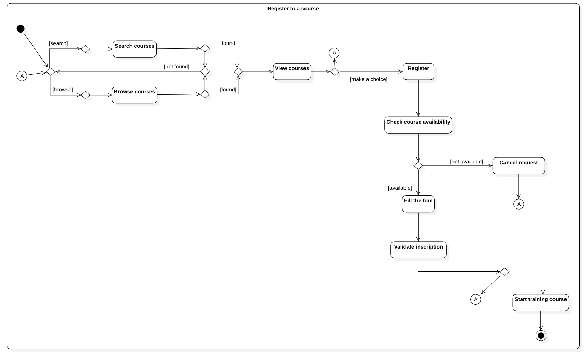

# Diagramme d'activité - Inscription aux formations

Ce diagramme ddépeint le processus d’inscription à une formation, illustrant les différentes étapes depuis la recherche et la sélection du cours jusqu’à l’inscription et le début de la formation.

[🔝 Retour à la Table des matières](../../../README.md#table-des-matieres)
