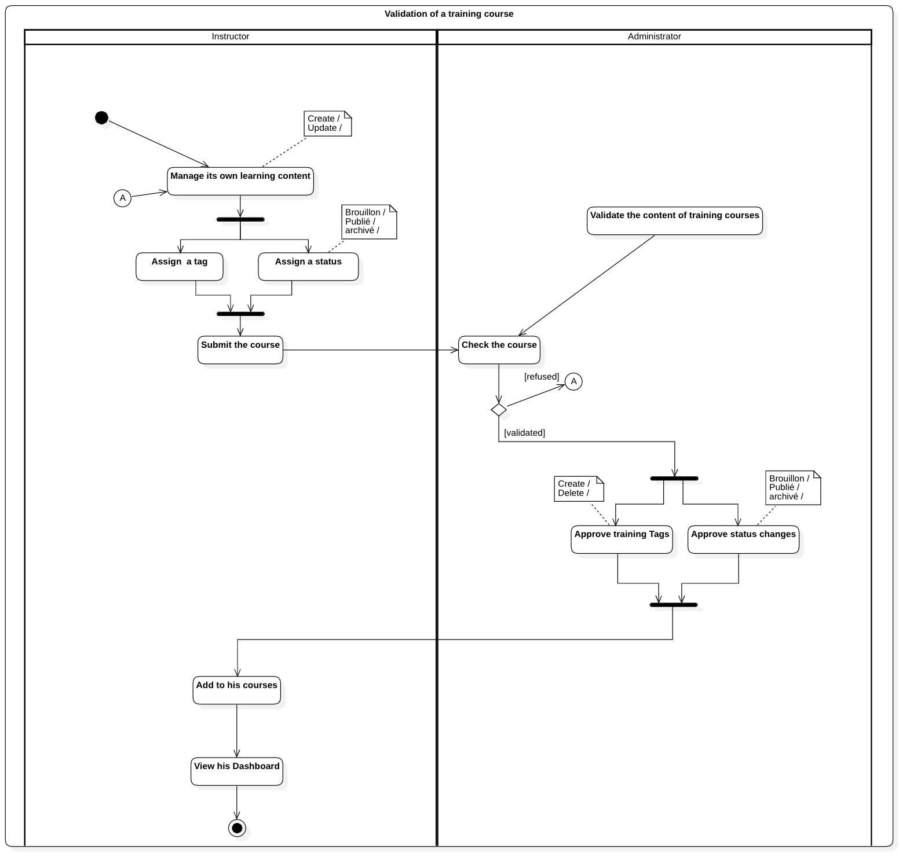

# Diagramme d'activité - Validation d'une formation

Ce diagramme décrit un flux de travail interactif entre le formateur et l’administrateur dans le processus de validation d'une formation assurant que le contenu proposé atteint un niveau de qualité conforme aux attentes administratives.

[🔝 Retour à la Table des matières](../../../README.md#table-des-matieres)
