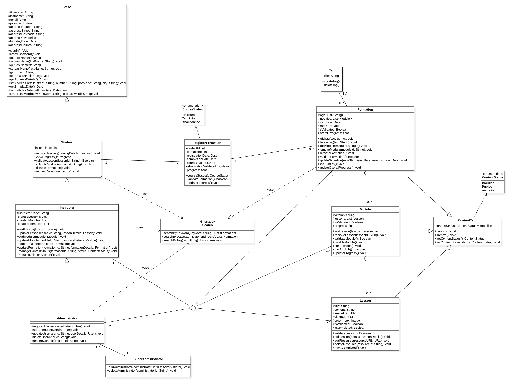

# Diagramme de classe -

Ce diagramme décrire le système de gestion de formations en ligne, où les utilisateurs peuvent s’inscrire, suivre des cours, et où les instructeurs peuvent créer et gérer le contenu des formations.

[🔝 Retour à la Table des matières](../../../README.md#table-des-matieres)
