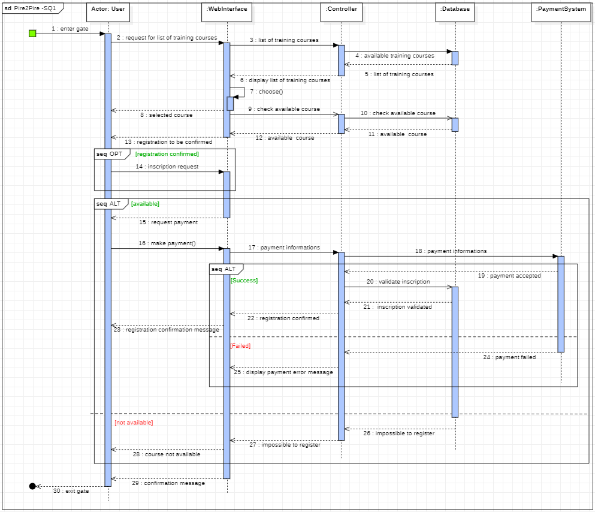

# Diagramme de séquence - Inscription à une formation

Ce diagrame met en évidence la logique de traitement, les interactions entre les différents composants, et la manière dont le système gère les différentes issues possibles, offrant une vision complète du processus d'inscription à une formation via le système.

Version textualisée de ce diagramme

### Participants :

- **User** - L'entité qui interagit avec le système pour s'inscrire à des formations.
- **Web Interface** - L'interface par laquelle l'utilisateur interagit avec le système.
- **Controller** - Le composant qui orchestre le flux du processus, transmettant les demandes entre l'interface utilisateur, la base de données, et le système de paiement.
- **Database** - Stocke les informations sur les formations disponibles et les inscriptions.
- **Payment System** - Gère le traitement des paiements.

### Flux du processus :

1. **Point de départ** : Là où l'utilisateur commence son action.
2. **Demande et Affichage des Cours** :
   - L'utilisateur demande la liste des cours disponibles (étape 2).
   - Le contrôleur récupère les informations depuis la base de données (étape 4) et les retourne à l'interface web qui les affiche à l'utilisateur (étape 6).
3. **Sélection et Vérification de la Disponibilité du Cours** :
   - L'utilisateur choisit un cours (étape 7), et le contrôleur vérifie sa disponibilité dans la base de données (étape 10).
4. **Inscription** :
   - Si le cours est disponible (étape 11), l'utilisateur procède à l'inscription (étape 14).
5. **Demande de Paiement** :
   - Le contrôleur demande un paiement à l'utilisateur (étape 15).
6. **Traitement du Paiement** :
   - L'utilisateur effectue le paiement (étape 16), et les informations sont transmises au système de paiement (étape 18).

### Gestion des alternatives :

1. **Validation du Paiement** :
   - Si le paiement est accepté (étape 19), le système de paiement valide l'inscription (étape 20), et le contrôleur confirme l'inscription à l'utilisateur (étape 22).
2. **Échec du Paiement** :
   - Si le paiement échoue (étape 24), un message d'erreur est affiché (étape 25).
3. **Indisponibilité du Cours** :
   - Si le cours n'est pas disponible (étape 11), un message indiquant l'impossibilité de s'inscrire est affiché (étape 28).

### Fin du Processus :

- Indépendamment de l'issue (réussite ou échec de l'inscription ou du paiement), l'utilisateur quitte le système (étape 30).

