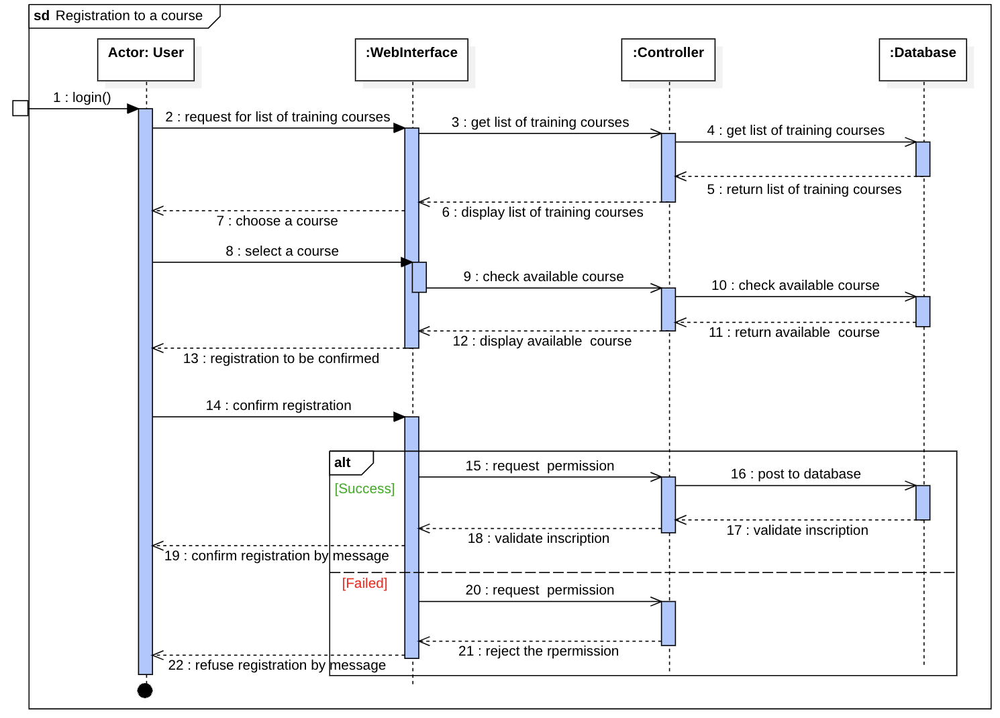

# Diagramme de séquence - Inscription à une formation

Ce diagramme décrit les interactions détaillées entre l’utilisateur, l’interface web, le contrôleur et la base de données pour le processus d’inscription à un cours de formation.

[🔝 Retour à la Table des matières](../../../README.md#table-des-matieres)
