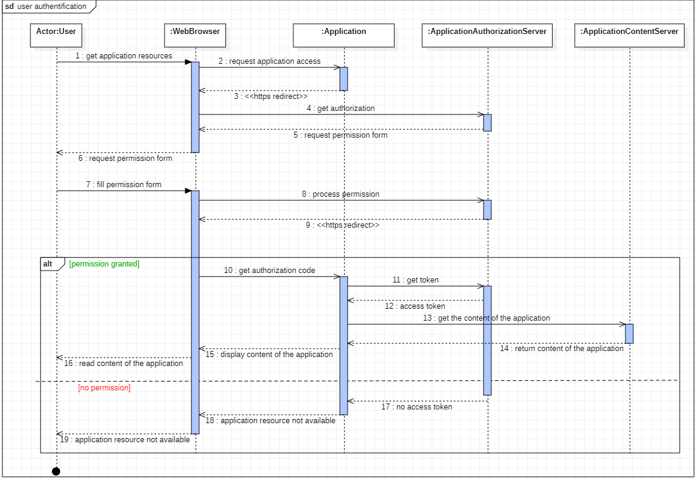

# Diagramme de séquence - Authentification basée sur OAuth

Ce diagramme illustre l’emploi du protocole d’autorisation **OAuth** pour renforcer la sécurité de l’accès aux ressources de notre application. Les redirections HTTPS, ainsi que l’échange de codes d’autorisation et de jetons, font partis des processus **OAuth**.

[🔝 Retour à la Table des matières](../../../README.md#table-des-matieres)
