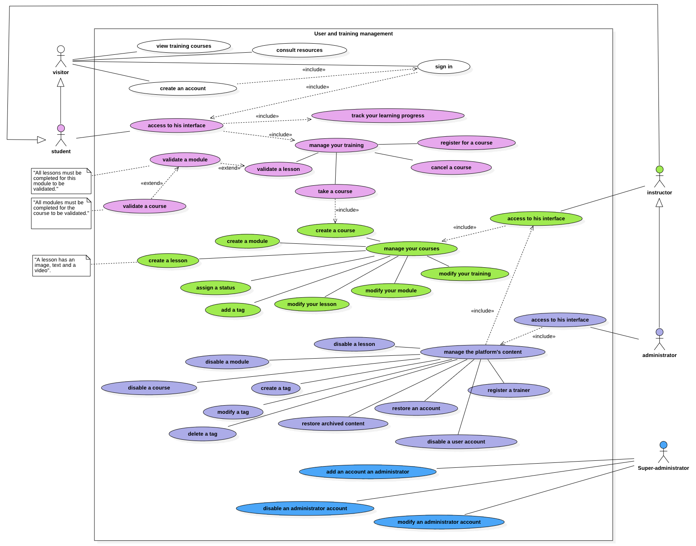

# Use Case

Un **Use Case** (ou cas d’utilisation) est une description détaillée d’une manière spécifique dont un utilisateur ou un système interagit avec une solution logicielle pour atteindre un objectif particulier. Il permet de clarifier les besoins fonctionnels et de documenter les interactions entre les utilisateurs et le système.  
Cette documentation est essentielle pour assurer la compréhension mutuelle entre les parties prenantes et l’équipe de développement.

[🔝 Retour à la Table des matières](../../../README.md#table-des-matieres)
